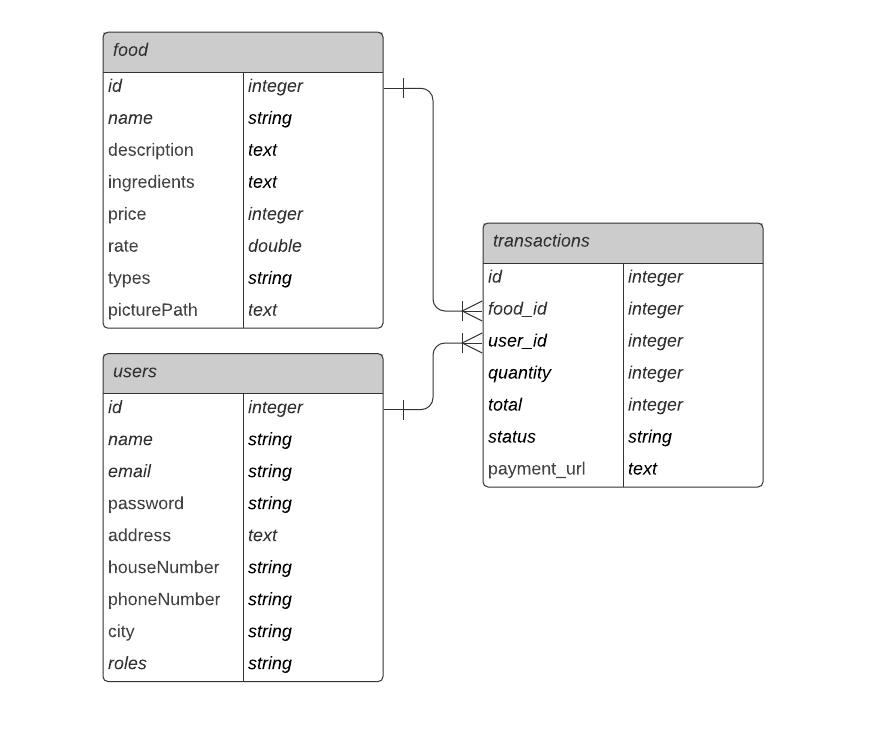

# Food Market Web

Food Market Web is website for food market product. This application build by Laravel v10.

## Development

Prepare for development this application.

### Extensions

- Laravel Blade Snippets
- Laravel Blade Spacer
- Laravel Model Snippet
- Laravel Snippets
- Laravel Extra Intellisense
- Laravel goto view
- Laravel goto controller
- PHP Docblocker
- PHP Intelephense
- PHP Namespace Resolver
- PHP Awesome Snippets
- PHPDoc Generator
- DotENV

### Library

- Laravel Jetstream
- Sentry (Bug Tracking)
- Mail

### Database

- Food
  - Name
  - Description
  - Ingredients
  - Price
  - Rate
  - Types
  - Picture

- User
  - Name
  - Email
  - Password
  - Roles
  - Address
  - Telephone
  - Mobile Phone
  - City
  - Photo Profile

- Transaction
  - Food
  - User
  - Quantity
  - Total
  - Status (delivered, on_delivery, pending, cancelled)
  - Payment Url

