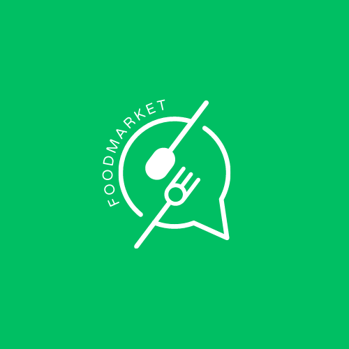

<br/>
<p align="center">
  <a href="https://github.com/gusrylmubarok/foodmarket-web">
    
  </a>

  <h3 align="center">FoodMarket Web</h3>

  <p align="center">
    Good food, good mood!
    <br/>
    <br/>
    <a href="https://github.com/gusrylmubarok/foodmarket-web"><strong>Explore the docs »</strong></a>
    <br/>
    <br/>
    <a href="https://github.com/gusrylmubarok/foodmarket-web/issues">Report Bug</a>
    .
    <a href="https://github.com/gusrylmubarok/foodmarket-web/issues">Request Feature</a>
  </p>
</p>

     

## Table Of Contents

* [About the Project](#about-the-project)
* [Built With](#built-with)
* [Getting Started](#getting-started)
  * [Prerequisites](#prerequisites)
  * [Installation](#installation)
* [Usage](#usage)
* [Contributing](#contributing)
* [License](#license)

## About The Project

Our food market website offers a wide variety of fresh and delicious food options that are perfect for any occasion. From appetizers to entrees, we have everything you need to satisfy your cravings and impress your guests. Our website is easy to navigate and features high-quality images of our products so you can see exactly what you’re getting. We also offer fast and reliable delivery so you can enjoy your favorite foods without leaving your home.

## Built With

This project built by some add-ons:

* [Laravel](https://laravel.com/)
* [Jetstream](https://jetstream.laravel.com/)
* [Midtrans PHP](https://github.com/Midtrans/midtrans-php)
* [MySQL](https://www.mysql.com/)

## Getting Started

For try this project on your own

### Prerequisites

* PHP
* Composer
* Laravel
* NPM
* Docker [mysql]

### Installation

1. Clone the repo

```sh
https://github.com/gusrylmubarok/foodmarket-web.git
```

2. Run Docker Image

```sh
make db-container-start
```

3. Configuration .env [database, mail, and midtrans]

## Usage

Use this space to show useful examples of how a project can be used. Additional screenshots, code examples and demos work well in this space. You may also link to more resources.

_For more examples, please refer to the [Documentation](https://example.com)_

## Contributing

Contributions are what make the open source community such an amazing place to be learn, inspire, and create. Any contributions you make are **greatly appreciated**.
* If you have suggestions for adding or removing projects, feel free to [open an issue](https://github.com/gusrylmubarok/foodmarket-web/issues/new) to discuss it, or directly create a pull request after you edit the *README.md* file with necessary changes.
* Please make sure you check your spelling and grammar.
* Create individual PR for each suggestion.
* Please also read through the [Code Of Conduct](https://github.com/gusrylmubarok/foodmarket-web/blob/main/CODE_OF_CONDUCT.md) before posting your first idea as well.

### Creating A Pull Request

1. Fork the Project
2. Create your Feature Branch (`git checkout -b feature/AmazingFeature`)
3. Commit your Changes (`git commit -m 'Add some AmazingFeature'`)
4. Push to the Branch (`git push origin feature/AmazingFeature`)
5. Open a Pull Request

## License

Distributed under the MIT License. See [LICENSE](https://github.com/gusrylmubarok/foodmarket-web/blob/main/LICENSE.md) for more information.
